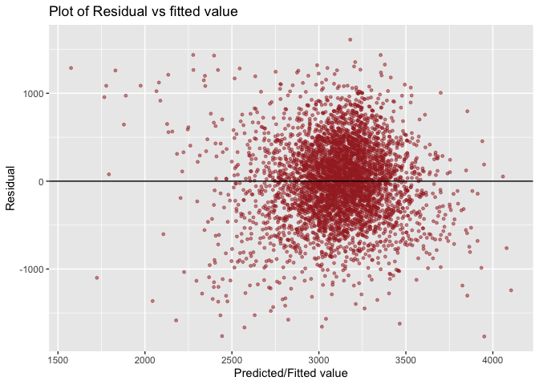
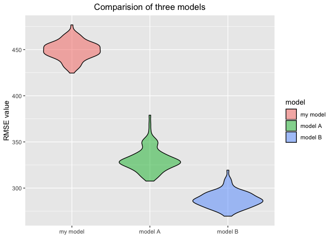
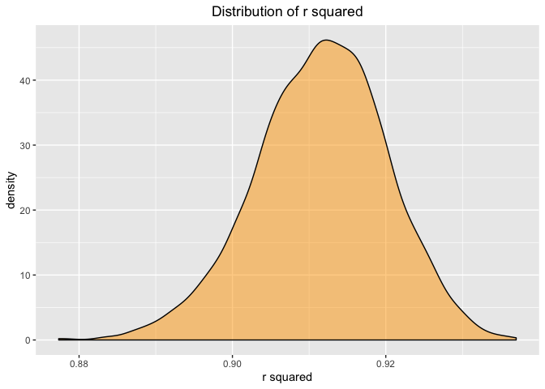
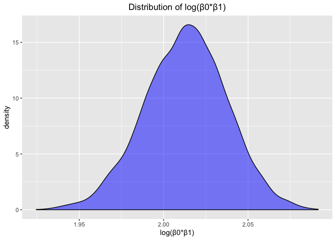

p8105\_hw6\_fj2269
================
Fangming Jin
11/15/2019

**Question 1**

**Clean dataset**

``` r
birthweight = read_csv(file = "./data/birthweight.csv") %>%
  janitor::clean_names() %>%
  mutate(babysex = factor(babysex, labels = c("male", "female")),
         frace = factor(frace, labels = c("White", "Black", " Asian", "Puerto Rican","Other")),
         malform = factor(malform, labels = c("absent", "present")),
         mrace = factor(mrace, labels = c("White", "Black", " Asian", "Puerto Rican")),
         ) %>%
  drop_na()
birthweight
```

    ## # A tibble: 4,342 x 20
    ##    babysex bhead blength   bwt delwt fincome frace gaweeks malform menarche
    ##    <fct>   <dbl>   <dbl> <dbl> <dbl>   <dbl> <fct>   <dbl> <fct>      <dbl>
    ##  1 female     34      51  3629   177      35 White    39.9 absent        13
    ##  2 male       34      48  3062   156      65 Black    25.9 absent        14
    ##  3 female     36      50  3345   148      85 White    39.9 absent        12
    ##  4 male       34      52  3062   157      55 White    40   absent        14
    ##  5 female     34      52  3374   156       5 White    41.6 absent        13
    ##  6 male       33      52  3374   129      55 White    40.7 absent        12
    ##  7 female     33      46  2523   126      96 Black    40.3 absent        14
    ##  8 female     33      49  2778   140       5 White    37.4 absent        12
    ##  9 male       36      52  3515   146      85 White    40.3 absent        11
    ## 10 male       33      50  3459   169      75 Black    40.7 absent        12
    ## # … with 4,332 more rows, and 10 more variables: mheight <dbl>,
    ## #   momage <dbl>, mrace <fct>, parity <dbl>, pnumlbw <dbl>, pnumsga <dbl>,
    ## #   ppbmi <dbl>, ppwt <dbl>, smoken <dbl>, wtgain <dbl>

**build the model**

I refer result of literature published in Journal of education and
health promotion: Risk factors of low birth weight and effect of them on
growth pattern of children up to sixth months of life: A cross-sectional
study.

In this study, mother’s age and weight, GA during delivery have a
significant relationship with birth weight. So we use momage, delwt and
gaweeks as predictors to build a linear regression model.

``` r
model = birthweight %>% 
  lm(bwt ~ momage + delwt + gaweeks, data = .) %>% 
  summary()
tidy_model = birthweight %>% 
  lm(bwt ~ momage + delwt + gaweeks, data = .) %>% 
  broom::tidy()
model
```

    ## 
    ## Call:
    ## lm(formula = bwt ~ momage + delwt + gaweeks, data = .)
    ## 
    ## Residuals:
    ##      Min       1Q   Median       3Q      Max 
    ## -1767.61  -284.30     4.69   290.50  1610.74 
    ## 
    ## Coefficients:
    ##              Estimate Std. Error t value Pr(>|t|)    
    ## (Intercept) -275.6856    95.1635  -2.897  0.00379 ** 
    ## momage         9.9957     1.7716   5.642 1.79e-08 ***
    ## delwt          5.4374     0.3097  17.555  < 2e-16 ***
    ## gaweeks       60.7630     2.1888  27.761  < 2e-16 ***
    ## ---
    ## Signif. codes:  0 '***' 0.001 '**' 0.01 '*' 0.05 '.' 0.1 ' ' 1
    ## 
    ## Residual standard error: 448.9 on 4338 degrees of freedom
    ## Multiple R-squared:  0.2324, Adjusted R-squared:  0.2319 
    ## F-statistic: 437.8 on 3 and 4338 DF,  p-value: < 2.2e-16

the parameter of predictor momage is 9.997, the parameter of predictor
delwt is 5.44, the parameter of gaweeks is 60.76. the intercept is
-275.69.

As we can see from this model, The p-value of these three predictors are
much less than 0.05, which means that effect of mother weight, age and
baby GA on baby birth weight is significant. The p-value of anova is \<
2.2e-16, which means that the overall influence of covariate is
significant. Adjusted R-squared is 0.2319. 23% of the variance found in
the response variable (birth weight) can be explained by the predictor
variable

The fitting formula of this model is as below:

\[
Y_{bwt}=-275.69+10X_{age}+5.44X_{weight}+60.76X_{GA}
\]

**Residual vs fitted value**

``` r
lm_birthweight = lm(bwt ~ momage + delwt + gaweeks, data = birthweight)
plot = birthweight %>% 
  modelr::add_predictions(lm_birthweight) %>% 
  modelr::add_residuals(lm_birthweight) %>% 
  rename("prediction" = pred, "residual" = resid) %>%
  ggplot(aes(x = prediction, y = residual)) +
    geom_point(size = 1, alpha = 0.5, color = "brown") +
    labs(title = "Plot of Residual vs fitted value", x="Predicted/Fitted value", y="Residual") + 
    geom_abline(intercept = 0, slope = 0)
plot
```

<!-- -->

**Compare of models**

We need to compare my model with another two model:

model A: using length at birth and gestational age as predictors (main
effects only)

model B: using head circumference, length, sex, and all interactions
(including the three-way interaction) between these

The result of model A is as below:

``` r
lm(bwt ~ blength + gaweeks, data = birthweight) %>% summary()
```

    ## 
    ## Call:
    ## lm(formula = bwt ~ blength + gaweeks, data = birthweight)
    ## 
    ## Residuals:
    ##     Min      1Q  Median      3Q     Max 
    ## -1709.6  -215.4   -11.4   208.2  4188.8 
    ## 
    ## Coefficients:
    ##              Estimate Std. Error t value Pr(>|t|)    
    ## (Intercept) -4347.667     97.958  -44.38   <2e-16 ***
    ## blength       128.556      1.990   64.60   <2e-16 ***
    ## gaweeks        27.047      1.718   15.74   <2e-16 ***
    ## ---
    ## Signif. codes:  0 '***' 0.001 '**' 0.01 '*' 0.05 '.' 0.1 ' ' 1
    ## 
    ## Residual standard error: 333.2 on 4339 degrees of freedom
    ## Multiple R-squared:  0.5769, Adjusted R-squared:  0.5767 
    ## F-statistic:  2958 on 2 and 4339 DF,  p-value: < 2.2e-16

The result of model B is as below:

``` r
lm(bwt ~ bhead * blength * babysex, data = birthweight) %>% summary()
```

    ## 
    ## Call:
    ## lm(formula = bwt ~ bhead * blength * babysex, data = birthweight)
    ## 
    ## Residuals:
    ##      Min       1Q   Median       3Q      Max 
    ## -1132.99  -190.42   -10.33   178.63  2617.96 
    ## 
    ## Coefficients:
    ##                               Estimate Std. Error t value Pr(>|t|)    
    ## (Intercept)                 -7176.8170  1264.8397  -5.674 1.49e-08 ***
    ## bhead                         181.7956    38.0542   4.777 1.84e-06 ***
    ## blength                       102.1269    26.2118   3.896 9.92e-05 ***
    ## babysexfemale                6374.8684  1677.7669   3.800 0.000147 ***
    ## bhead:blength                  -0.5536     0.7802  -0.710 0.478012    
    ## bhead:babysexfemale          -198.3932    51.0917  -3.883 0.000105 ***
    ## blength:babysexfemale        -123.7729    35.1185  -3.524 0.000429 ***
    ## bhead:blength:babysexfemale     3.8781     1.0566   3.670 0.000245 ***
    ## ---
    ## Signif. codes:  0 '***' 0.001 '**' 0.01 '*' 0.05 '.' 0.1 ' ' 1
    ## 
    ## Residual standard error: 287.7 on 4334 degrees of freedom
    ## Multiple R-squared:  0.6849, Adjusted R-squared:  0.6844 
    ## F-statistic:  1346 on 7 and 4334 DF,  p-value: < 2.2e-16

``` r
cross_valid = 
  crossv_mc(birthweight, 100) %>%
  mutate(
    train = map(train, as_tibble),
    test = map(test, as_tibble)) %>%
  mutate(model1_mod  = map(train, ~lm(bwt ~ momage + delwt + gaweeks, data = .x)),
         model2_mod  = map(train, ~lm(bwt ~ blength + gaweeks, data = .x)),
         model3_mod  = map(train, ~lm(bwt ~ bhead * blength * babysex, data = .x))) %>% 
  mutate(rmse_model1 = map2_dbl(model1_mod, test, ~rmse(model = .x, data = .y)),
         rmse_model2 = map2_dbl(model2_mod, test, ~rmse(model = .x, data = .y)),
         rmse_model3 = map2_dbl(model3_mod, test, ~rmse(model = .x, data = .y))) %>%
  select(starts_with("rmse")) %>% 
  pivot_longer(
    everything(),
    names_to = "model", 
    values_to = "rmse",
    names_prefix = "rmse_") %>% 
  mutate(model = fct_inorder(model),
         model = recode(model, "model1" = "my model", "model2" = "model A", "model3" = "model B")) %>% 
  ggplot(aes(x = model, y = rmse)) + 
    geom_violin(aes(fill = model), color = "black", alpha = .5) +
    labs(title = "Comparision of three models", y="RMSE value") +
    theme(plot.title = element_text(hjust = 0.5), axis.title.x=element_blank())
cross_valid
```

<!-- -->

As we can see from the violin plot, model B have the lowest mean and
median of root mean squared errors, the model I built have the highest
mean and median of root mean squared errors, and model A is in the
middle. This means in these three model, prediction accuracy of model B
is relatively high, the prediction accuracy of my model is relatively
low, the prediction accuracy of model A is in the middle.

**Question 2**

First we use 5000 bootstrap samples and produce estimates of these two
quantities for each bootstrap sample.

``` r
weather_df = 
  meteo_pull_monitors(
    c("USW00094728"),
    var = c("PRCP", "TMIN", "TMAX"), 
    date_min = "2017-01-01",
    date_max = "2017-12-31") %>%
  mutate(
    name = recode(id, USW00094728 = "CentralPark_NY"),
    tmin = tmin / 10,
    tmax = tmax / 10) %>%
  select(name, id, everything())
```

    ## file path:          /Users/fangmingjin/Library/Caches/rnoaa/ghcnd/USW00094728.dly

    ## file last updated:  2019-11-24 22:01:45

    ## file min/max dates: 1869-01-01 / 2019-11-30

``` r
bootstrap_weather = 
  weather_df %>%
  modelr::bootstrap(n = 5000) %>%
  mutate(
    models = map(strap, ~lm(tmax ~ tmin, data = .x)),
    results = map(models, broom::glance),
    results2 = map(models, broom::tidy)) %>% 
  select(-strap, -models) %>% 
  unnest(results, results2) %>% 
  select(.id, r.squared, term, estimate) %>%
  pivot_wider(
    names_from = term,
    values_from = estimate
  ) %>%
  rename("intercept" = `(Intercept)`) %>%
  mutate(log = log(intercept*tmin, base = exp(1))) %>%
  select(r.squared, log)
```

    ## Warning: unnest() has a new interface. See ?unnest for details.
    ## Try `df %>% unnest(c(results, results2))`, with `mutate()` if needed

``` r
bootstrap_weather
```

    ## # A tibble: 5,000 x 2
    ##    r.squared   log
    ##        <dbl> <dbl>
    ##  1     0.915  2.02
    ##  2     0.893  2.03
    ##  3     0.907  2.00
    ##  4     0.912  1.97
    ##  5     0.920  2.01
    ##  6     0.911  2.02
    ##  7     0.914  2.02
    ##  8     0.917  2.02
    ##  9     0.911  2.02
    ## 10     0.922  2.00
    ## # … with 4,990 more rows

Plot the distribution of two quantity

``` r
plot_boot1 = bootstrap_weather %>%
  ggplot(aes(x = r.squared)) +
    geom_density(fill = "orange", color = "black", alpha = 0.5) +
    labs(title = "Distribution of r squared", x="r squared", y="density") +
    theme(plot.title = element_text(hjust = 0.5))
plot_boot1
```

<!-- -->

through cruve above is still skewed for its left tail is longer than the
right one. The distribution of r squared is closed to normal
distribution. Its mean is 0.9115, its sd is 0.0084

``` r
plot_boot2 = bootstrap_weather %>%
  ggplot(aes(x = log)) +
    geom_density(fill = "blue", color = "black", alpha = 0.5) +
    labs(title = "Distribution of log(β0*β1)", x="log(β0*β1)", y="density") +
    theme(plot.title = element_text(hjust = 0.5))
plot_boot2
```

<!-- -->

Through the distribution of value on the peak of this cruve is a little
bit irregular.The distribution of log of estimated beta0 multiple beta1
is closed to normal distribution. Its mean is 2.013, its sd is 0.0244

95% CI for r squared and
log(beta0\*beta1)

``` r
lower_limit_r = quantile(pull(bootstrap_weather,r.squared), probs = c(0.025, 0.975)) %>% 
  .[[1]] %>%
  round(., 3)
upper_limit_r = quantile(pull(bootstrap_weather,r.squared), probs = c(0.025, 0.975)) %>% 
  .[[2]] %>%
  round(., 3)
lower_limit_log = quantile(pull(bootstrap_weather,log), probs = c(0.025, 0.975)) %>% 
  .[[1]] %>%
  round(., 3)
upper_limit_log = quantile(pull(bootstrap_weather,log), probs = c(0.025, 0.975)) %>% 
  .[[2]] %>%
  round(., 3)
```

The 95% CI for r squared is (0.894, 0.927), The 95% CI for
log(beta0\*beta1) is (1.964, 2.059)
